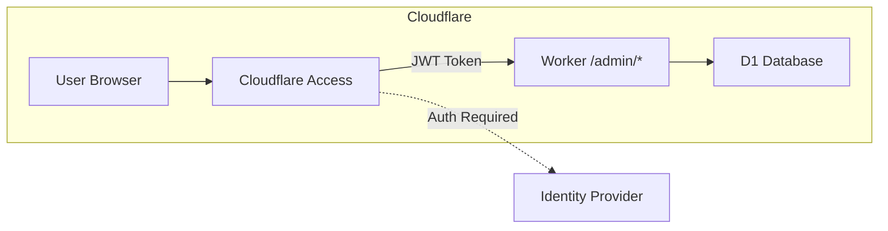

# Admin UI Implementation Plan

## Overview

Build a simple admin UI protected by Cloudflare Zero Trust Access that allows managing:

- **Benchmark versions** - set current, toggle hidden status
- **Submissions** - view and manage submission data
- **Tokens** - view registered API tokens

## Architecture



## Implementation Details

### 1. Authentication Middleware

**File:** `src/utils/adminAuth.ts`

Cloudflare Access adds a `CF-Access-JWT-Assertion` header to authenticated requests. The middleware will:

- Validate the JWT signature using Cloudflare's JWKS endpoint
- Extract user identity from the JWT claims
- Block unauthorized requests with 401

```typescript
// Key validation approach
const CERTS_URL = `https://<team-domain>.cloudflareaccess.com/cdn-cgi/access/certs`;
```

### 2. Admin Routes Structure

**File:** `src/routes/admin.ts`

| Method | Route                        | Description                          |
| ------ | ---------------------------- | ------------------------------------ |
| GET    | `/admin`                     | HTML admin dashboard                 |
| GET    | `/admin/api/versions`        | List all versions including hidden   |
| PUT    | `/admin/api/versions/:id`    | Update version current/hidden status |
| GET    | `/admin/api/submissions`     | List submissions with pagination     |
| DELETE | `/admin/api/submissions/:id` | Delete a submission                  |
| GET    | `/admin/api/tokens`          | List all tokens                      |

### 3. HTML Admin UI

A single-page HTML interface served directly from the Worker. Uses:

- Vanilla JavaScript for no build step
- Fetch API for backend calls
- Simple table-based UI with action buttons

**Features:**

- **Versions Tab**: Toggle current/hidden for each version
- **Submissions Tab**: Paginated list with delete option
- **Tokens Tab**: View tokens with claimed status

### 4. Database Operations

**Benchmark Versions Management:**

```sql
-- Set version as current and unset all others
UPDATE benchmark_versions SET current = 0;
UPDATE benchmark_versions SET current = 1 WHERE id = ?;

-- Toggle hidden
UPDATE benchmark_versions SET hidden = ? WHERE id = ?;
```

**Submissions Management:**

```sql
-- Delete submission
DELETE FROM submissions WHERE id = ?;
```

### 5. Configuration Changes

**wrangler.jsonc additions:**

```jsonc
{
  "vars": {
    "CF_ACCESS_TEAM_DOMAIN": "your-team.cloudflareaccess.com",
    "CF_ACCESS_AUD": "<application-audience-tag>",
  },
}
```

**Cloudflare Dashboard Configuration:**

1. Create Zero Trust Access Application in your personal Cloudflare account
2. Set application domain to `<your-api-domain>/admin/*`
3. Add policy: Allow emails ending in `@olearycrew.com` OR `brendano86@gmail.com`
4. Note the Application Audience tag for JWT validation

## File Changes Summary

| File                     | Change Type | Description                   |
| ------------------------ | ----------- | ----------------------------- |
| `src/utils/adminAuth.ts` | New         | JWT validation middleware     |
| `src/routes/admin.ts`    | New         | Admin API and HTML routes     |
| `src/index.ts`           | Modify      | Register admin routes         |
| `src/types.ts`           | Modify      | Add admin-related types       |
| `wrangler.jsonc`         | Modify      | Add Access configuration vars |

## Security Considerations

1. **JWT Validation**: Always validate the full JWT, not just check for header presence
2. **CORS**: Admin routes should NOT have CORS enabled since they're same-origin
3. **Audit Logging**: Consider logging admin actions to raw_post_logs
4. **Least Privilege**: Admin routes are separate from public API

## Implementation Order

1. Create Cloudflare Access application in dashboard first
2. Implement and test auth middleware
3. Build API routes with auth
4. Create HTML UI
5. Test end-to-end with Access enabled

## Implementation Status

✅ **Completed:**

- Admin authentication middleware (`src/utils/adminAuth.ts`)
- Admin API routes and HTML UI (`src/routes/admin.ts`)
- Updated types (`src/types.ts`)
- Updated wrangler config (`wrangler.jsonc`)
- Integrated into main app (`src/index.ts`)

## Setup Instructions

### 1. Configure Cloudflare Access (Required for Production)

1. Go to Cloudflare Zero Trust Dashboard → Access → Applications
2. Click "Add an application" → Self-hosted
3. Configure:
   - **Application name**: PinchBench Admin
   - **Session duration**: 24 hours
   - **Application domain**: `your-api-domain.com`
   - **Path**: `/admin/*`
4. Add an Access Policy:
   - **Policy name**: Admin Access
   - **Action**: Allow
   - **Include rule**: Emails ending in `@olearycrew.com` or `brendano86@gmail.com`
5. After saving, copy the **Application Audience (AUD) Tag**

### 2. Set Environment Variables

In Cloudflare Workers dashboard or via wrangler:

```bash
# Set via Cloudflare dashboard (Settings → Variables)
CF_ACCESS_TEAM_DOMAIN=<your-team>.cloudflareaccess.com
CF_ACCESS_AUD=<your-application-audience-tag>
```

Or for local development:

```bash
CF_ACCESS_BYPASS=true  # Skips auth for local testing
```

### 3. Deploy

```bash
npx wrangler deploy
```

### 4. Access Admin UI

Navigate to `https://your-api-domain/admin` and authenticate via Cloudflare Access.
